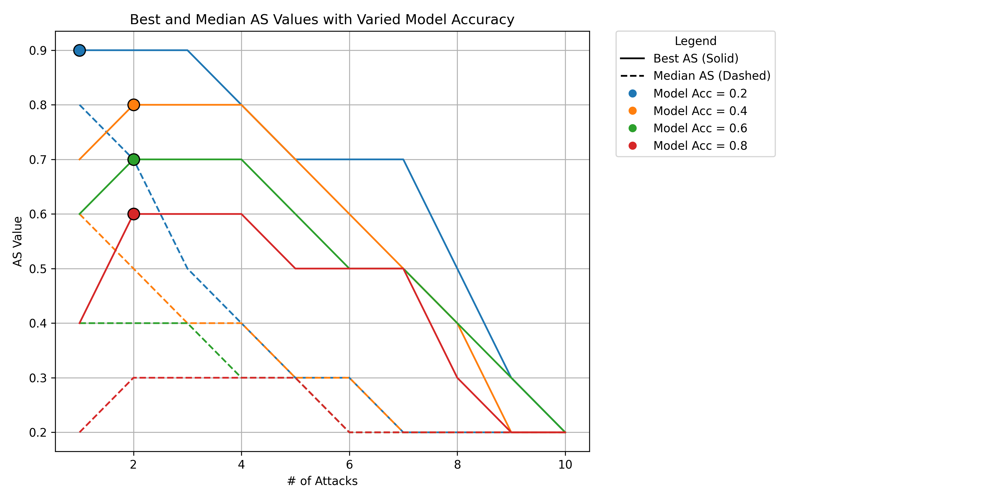
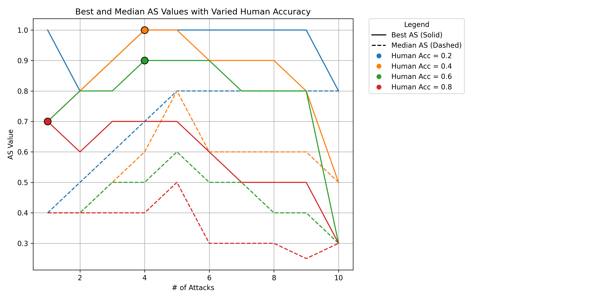
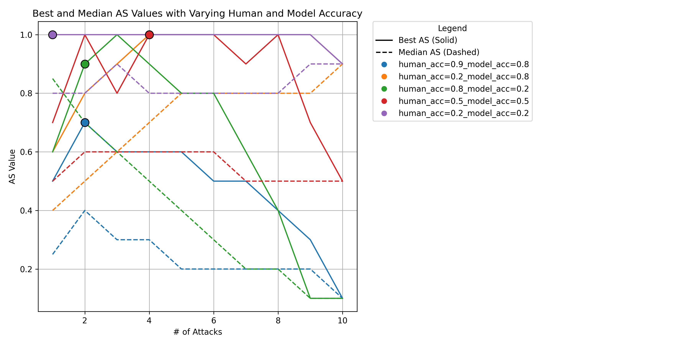
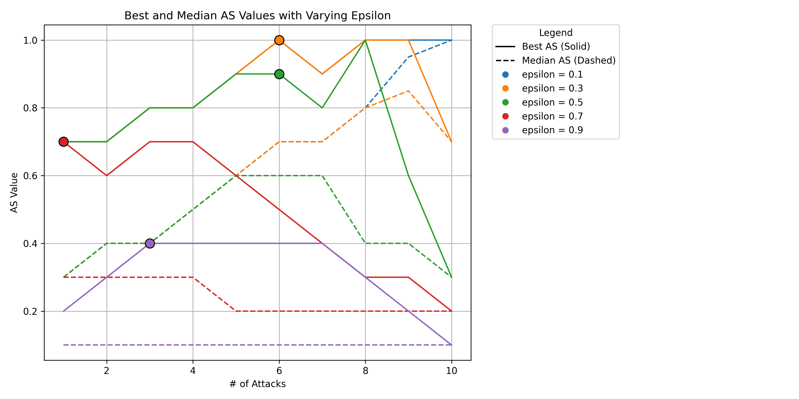

# The Simulation Analysis
**Question:**

**Response:**  
We appreciate the reviewer’s comments. We have conducted systematic sensitivity analyses to assess the robustness of our conclusions. he sensitivity analysis is conducted over the dimensions including model accuracy (*pₘ*), reliance thresholds (*rhat*), and human accuracy (*pₕ*). 

- *Model/human accuracy* refer to the prediction accuracy of the AI model and human, respectively.  
- The *reliance threshold* determines the point at which humans choose to fully accept AI outputs without seeking additional validation.

We summarize our results below; detailed results are presented in the table/figure?? at the end.

### Model Accuracy  
We varied AI model accuracy values from 0.2 to 0.8 (with human accuracy fixed) and observed that higher model accuracy consistently leads to lower attack success rates (AS values), but does not significantly change the system’s sensitivity to the number of attacks.

### Human Accuracy  
We fixed model accuracy and varied human accuracy from 0.2 to 0.8, demonstrating that lower human accuracy makes the system more vulnerable. This suggests that the attack becomes more effective when humans are less capable of identifying the AI's outputs.

### Model Accuracy and Human Accuracy  
We further varied the different combinations of model accuracy and human accuracy. The result shows that attack effectiveness depends not just on the model but on both human accuracy and model accuracy. Systems are most vulnerable when users blindly trust AI without output verification. High human accuracy in the loop significantly reduce the risk of adversarial attacks, even when the AI is imperfect.

### Reliance Threshold  
We analyzed five reliance threshold values from 0.1 to 0.9. The results show that a low reliance threshold, i.e., humans tending to trust AI, makes the system more vulnerable to adversarial attacks. This indicates the reliance threshold is a critical parameter for the robustness of human-AI decision-making systems.

